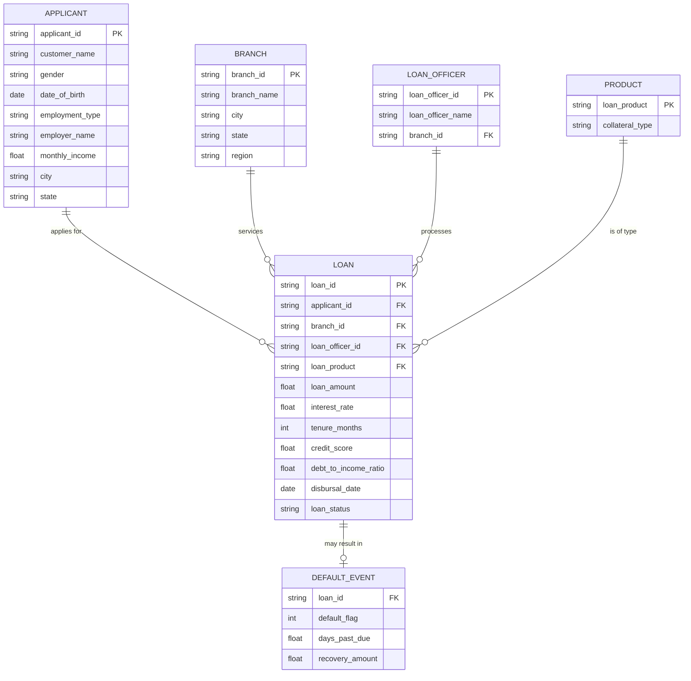
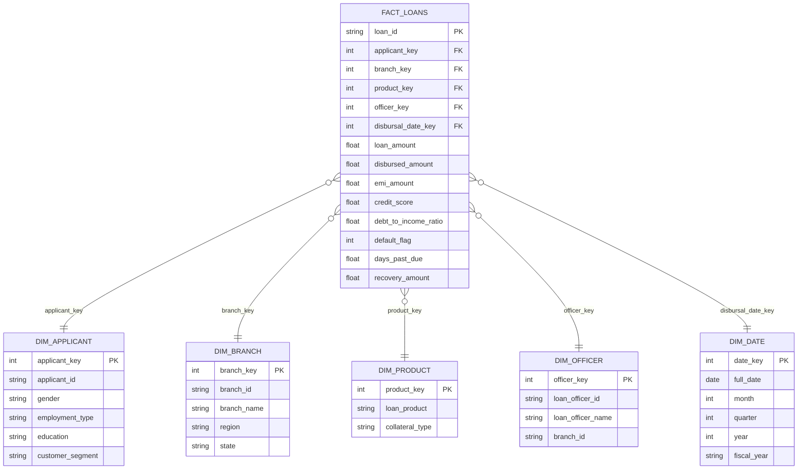

# FinEdge Capital — ER Diagram, Star Schema Mapping & SQL DDL

## 1. Source-System ER Diagram (as extracted — one flat table)

The raw CSV/XLSX arrives as a single flat extract (as real core-banking exports
usually do). Logically, it represents these entities and relationships:



*(Paste this block into a Mermaid live editor or any Mermaid-enabled markdown viewer — e.g. mermaid.live, GitHub README, or VS Code with the Mermaid extension — to render it visually.)*

---

## 2. Star Schema Mapping (for Power BI)

The flat CSV is deliberately denormalized. For Power BI, split it into one fact table and five dimension tables — this is what makes the DAX time-intelligence measures (rolling default rate, YoY change) work correctly and keeps the model performant at 120K+ rows.



**Mapping notes:**
- `Fact_Loans` grain = one row per loan (same grain as the source CSV — no fan-out).
- `Dim_Date` should be a standalone generated calendar table (not derived from `disbursal_date` alone) so it can also join to `application_date`/`approval_date` via role-playing dimensions in Power BI, if needed later.
- Surrogate integer keys (`_key` columns) are recommended over the string business keys (`branch_id`, etc.) for BI model performance — generate them during the ETL/load step.

---

## 3. SQL DDL — Staging Table (matches raw CSV exactly)

```sql
CREATE TABLE stg_loans_raw (
    loan_id                    VARCHAR(15),
    applicant_id                VARCHAR(15),
    customer_name                VARCHAR(100),
    gender                        VARCHAR(10),
    date_of_birth                VARCHAR(20),   -- kept as text; mixed formats cleaned in ETL
    age                            INT,
    marital_status                VARCHAR(20),
    education                    VARCHAR(30),
    occupation                    VARCHAR(60),
    employment_type                VARCHAR(40),
    employer_name                VARCHAR(100),
    years_with_employer            NUMERIC(5,1),
    annual_income                NUMERIC(14,2),
    monthly_income                NUMERIC(14,2),
    city                        VARCHAR(50),
    state                        VARCHAR(50),
    pincode                        VARCHAR(10),
    branch_id                    VARCHAR(10),
    branch_name                    VARCHAR(80),
    region                        VARCHAR(20),
    loan_product                VARCHAR(30),
    loan_purpose                VARCHAR(60),
    loan_amount                    NUMERIC(14,2),
    sanctioned_amount            NUMERIC(14,2),
    disbursed_amount            NUMERIC(14,2),
    interest_rate                NUMERIC(5,2),
    tenure_months                INT,
    emi_amount                    NUMERIC(14,2),
    processing_fee                NUMERIC(12,2),
    credit_score                NUMERIC(5,0),
    debt_to_income_ratio        NUMERIC(6,3),
    existing_loans_count        INT,
    existing_emi_obligations    NUMERIC(14,2),
    collateral_type                VARCHAR(30),
    collateral_value            NUMERIC(14,2),
    co_applicant_flag            VARCHAR(5),
    application_date            VARCHAR(20),   -- mixed formats, cleaned in ETL
    approval_date                VARCHAR(20),
    disbursal_date                VARCHAR(20),
    loan_status                    VARCHAR(20),
    default_flag                    SMALLINT,
    days_past_due                NUMERIC(6,0),
    npa_flag                    VARCHAR(5),
    recovery_amount                NUMERIC(14,2),
    loan_officer_id                VARCHAR(10),
    loan_officer_name            VARCHAR(100),
    payment_history_score        NUMERIC(5,0),
    bounce_count                    INT,
    risk_category                VARCHAR(15),
    customer_segment            VARCHAR(20),
    is_fraud_suspected            VARCHAR(5),
    kyc_verified                VARCHAR(5),
    channel                        VARCHAR(30)
);
```

## 4. SQL DDL — Star Schema (post-cleaning target tables)

```sql
CREATE TABLE dim_branch (
    branch_key      SERIAL PRIMARY KEY,
    branch_id       VARCHAR(10) UNIQUE NOT NULL,
    branch_name     VARCHAR(80),
    city            VARCHAR(50),
    state           VARCHAR(50),
    region          VARCHAR(20)
);

CREATE TABLE dim_product (
    product_key     SERIAL PRIMARY KEY,
    loan_product    VARCHAR(30) UNIQUE NOT NULL,
    collateral_type VARCHAR(30)
);

CREATE TABLE dim_officer (
    officer_key       SERIAL PRIMARY KEY,
    loan_officer_id   VARCHAR(10) UNIQUE NOT NULL,
    loan_officer_name VARCHAR(100),
    branch_key        INT REFERENCES dim_branch(branch_key)
);

CREATE TABLE dim_applicant (
    applicant_key     SERIAL PRIMARY KEY,
    applicant_id      VARCHAR(15) UNIQUE NOT NULL,
    gender            VARCHAR(10),
    employment_type   VARCHAR(40),
    education         VARCHAR(30),
    customer_segment  VARCHAR(20)
);

CREATE TABLE dim_date (
    date_key   INT PRIMARY KEY,      -- format YYYYMMDD
    full_date  DATE NOT NULL,
    day        INT,
    month      INT,
    month_name VARCHAR(15),
    quarter    INT,
    year       INT,
    fiscal_year VARCHAR(10)
);

CREATE TABLE fact_loans (
    loan_id               VARCHAR(15) PRIMARY KEY,
    applicant_key         INT REFERENCES dim_applicant(applicant_key),
    branch_key            INT REFERENCES dim_branch(branch_key),
    product_key           INT REFERENCES dim_product(product_key),
    officer_key           INT REFERENCES dim_officer(officer_key),
    disbursal_date_key    INT REFERENCES dim_date(date_key),
    loan_amount           NUMERIC(14,2),
    sanctioned_amount     NUMERIC(14,2),
    disbursed_amount      NUMERIC(14,2),
    interest_rate         NUMERIC(5,2),
    tenure_months         INT,
    emi_amount            NUMERIC(14,2),
    credit_score          NUMERIC(5,0),
    debt_to_income_ratio  NUMERIC(6,3),
    loan_status           VARCHAR(20),
    default_flag          SMALLINT,
    days_past_due         NUMERIC(6,0),
    recovery_amount       NUMERIC(14,2)
);

-- Recommended indexes
CREATE INDEX idx_fact_loans_branch ON fact_loans(branch_key);
CREATE INDEX idx_fact_loans_date ON fact_loans(disbursal_date_key);
CREATE INDEX idx_fact_loans_status ON fact_loans(loan_status, default_flag);
```
